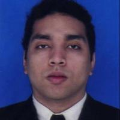

Mi nombre es Cristian Camilo Castrillón Ricardo, tengo 30 años y soy de la ciudad de Montería, Córdoba.

Soy ingeniero informático de la Universidad Pontificia Bolivariana, sin embargo, despúes de haber obtenido mi título profesional, regresé a la ciudad de Montería para conseguir empleo pero no tuve mucha suerte por 5 años.

Me encuentro en estos momentos asistiendo al camp de Make it Real con la intensión de ampliar mis conocimientos.

